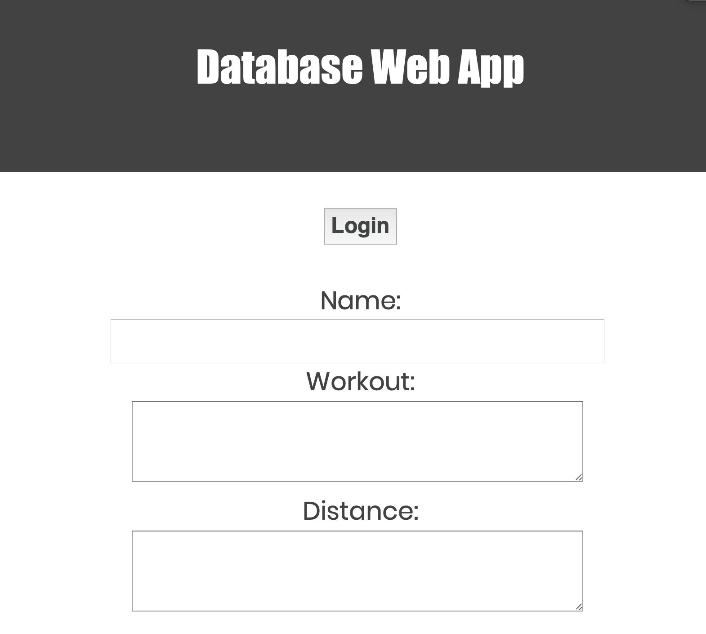
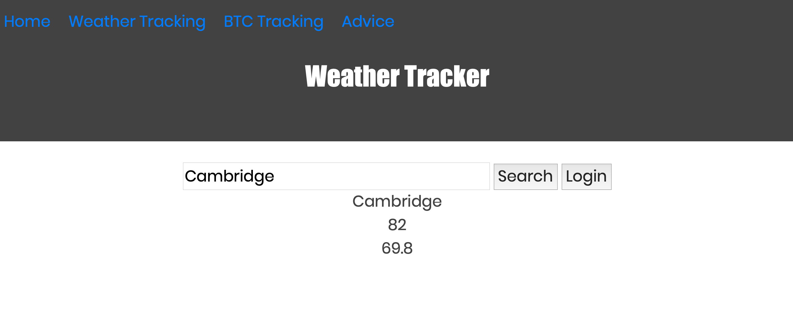
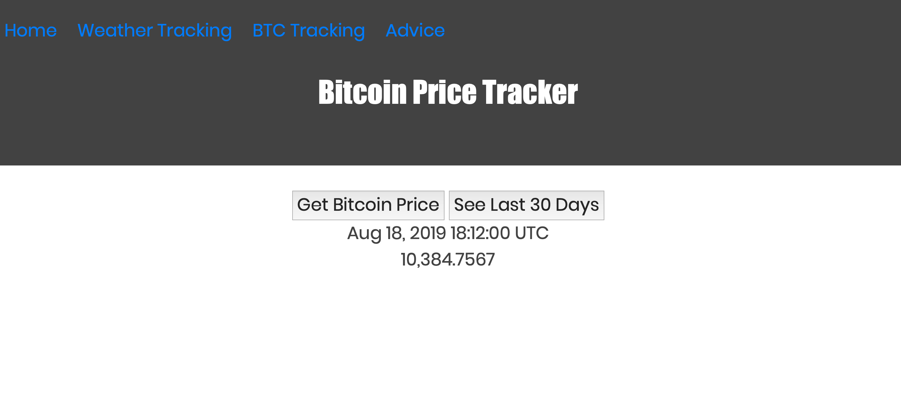
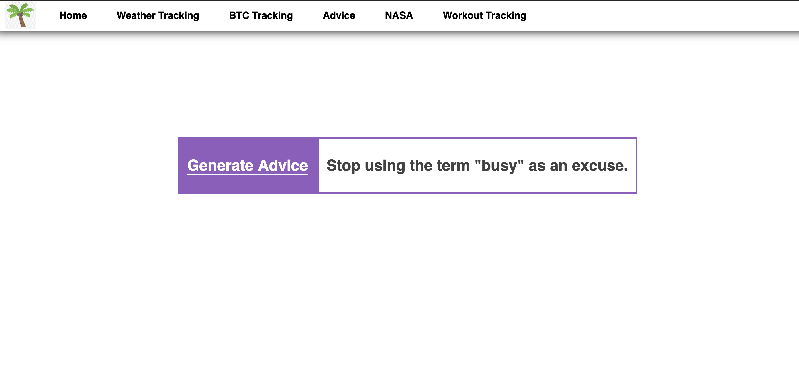

# Simple Web App with API and Firebase Integrations

Check out the original app from HubSpot at: https://intense-depths-97149.herokuapp.com/

I can't recommend this course enough! Check it out and more [here.](https://app.hubspot.com/learning-center)

## About
My ongoing internship-hunting for next summer has led me down a lot of paths and pointed to many different companies. One of
the companies that caught my eye, and that I had remembered from the Tufts Career Fair, was HubSpot. After delving into the
culture of the company through various Internet surfing including Reddit threads, Youtube videos, etc. I stumbled upon a page
detailing their workshops aimed at teaching aspiring coders to build and deploy their own web application from scratch. These
workshops stemmed from their findings that the percentage of women graduating with a computer science degree had fallen to a 
pathetic 18%, and were geared toward increasing the confidence of females in tech.

I've also recently developed an interest in web development and design, so this course was perfect!

Through this project, I became comfortable with Node and Express.js, Firebase, JavaScript and its jQuery library, and 
integrating dynamic APIs into my app. I also was able to update the HTML and CSS for a more personalized page.

## Integrating APIs

One important thing I learned is that bots constantly scrape GitHub for API keys left on code. Thus, I had to keep my keychain 
local, and never pushed or deployed code that held my keys. 

After signing up for a key for the API of your choosing, you can save API keys locally to your .env file, which is never pushed to GitHub or Heroku to keep keys private and secure. The web app  reads from that file locally and pulls from Heroku’s configuration system after deployment.

Most APIs also require some form of authorization. By letting only authorized users make requests, it better protects the API from abuse. I used Firebase authentication to force users to sign in before using the workout tracker.

## Running the app
After installing the project's dependencies by executing
```
	npm install 
```
on your command line, cloning the project and installing Heroku's command line tools, you can run the app on your local server using
```
	heroku local web	
```
and opening a browser and navigating to `localhost:5000`.


## Real-time data from Firebase 


## Dynamic API Integrations

### Weather Tracker: Used OpenWeather's API to pull high/low temperatures of a queried city.


### BTC Rate Tracker: Used CoinDesk's API to display the current trading rate of Bitcoin and past 31 days of trading data

*A whole 7k more than it was worth in December!*


### Advice Generator: Used AdviceSlip.json API to generate random advice.

*Each click generates a random color of the rainbow - this one happened to be a lovely periwinkle.*

### NASA EPOD
... and my personal favorite, NASA's Earth Picture of the Day.


## Issues along the way
They told me again and again, and it's definitely true - Googling everything works! When I had an early roadbump trying 
to parse a JSON array, Google (and Stack Overflow) saved me. I plan on continuing to use these resources for design 
inspiration, integration help, etc.

## To-Do
I hope to eventually integrate some of these APIs into my [personal website.](https://www.sook-hee.com)

- [X] Integrate the NASA API to include the Earth image of the day.
- [ ] Modularize the CSS (can't maintain this without losing my mind).
- [ ] Add a sticky note component to help keep track of all my thoughts and ideas.
- [ ] Integrate Nutritionix and use Firebase to store user data to track eating habits and meals, along with their nutritional
value. A good way to keep myself and others accountable!
- [ ] Add month-long graphs and other cryptocurrencies to BTC tracker page.
- [ ] Update CSS and HTML to further personalize my web app.

My *big* future plan is to create a page for the women's swim team at Tufts to use to track their winter break workouts,
hopefully to store both types and lengths, and maybe include some cool graphics to see what subset of the team has the
highest performance. Currently, we keep track of workouts on a Google Sheet, which definitely gets messy. 
